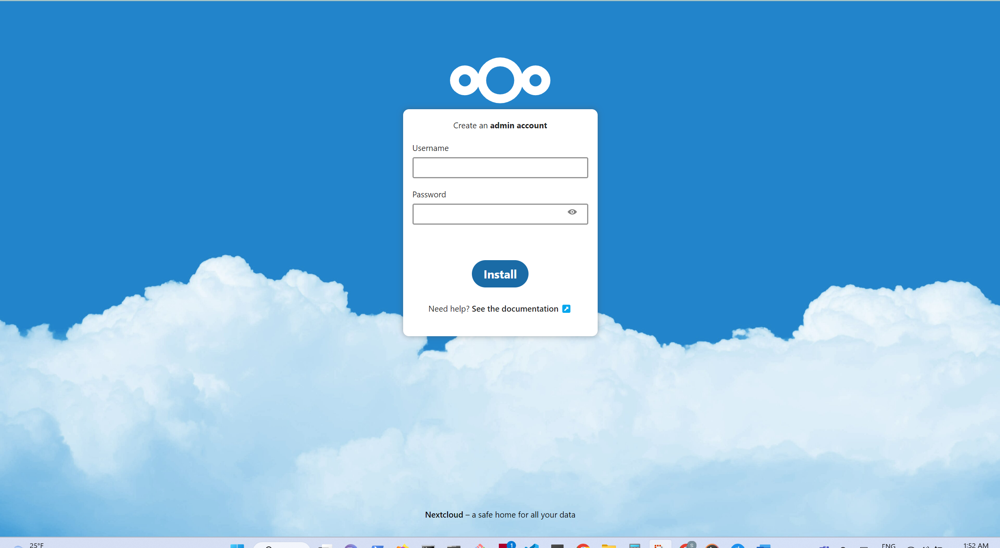

# Nextcloud Application

## Nextcloud-Redis and MariaDB with Docker Compose

This example defines one of setups for Nextcloud. More details on how to
further customize the installation and the compose file can be found on the
[official image page](https://hub.docker.com/_/nextcloud).


Project structure:
```
.
├── compose.yml
└── README.md
└── Screenshots.pdf
```

[_compose.yml_](compose.yml)
```
services:
  nc:
    image: nextcloud:apache
    ports:
      - 80:80
    ...
  redis:
    image: redis:alpine
    restart: always
    networks:
      - redisnet
  db:
    image: mariadb
    ...
```

When deploying this setup, docker compose maps the nextcloud container port 80 to
port 80 of the host as specified in the compose file.

## Deploy with docker compose

```
PS C:\Users\12048\Desktop\dockerc> docker-compose up
[+] Running 7/7
 - Network dockerc_redisnet   Created                                                                                                                                                           0.9s
 - Network dockerc_dbnet      Created                                                                                                                                                           0.8s
 - Volume "dockerc_db_data"   Created                                                                                                                                                           0.0s
 - Volume "dockerc_nc_data"   Created                                                                                                                                                           0.0s
 - Container dockerc-db-1     Created                                                                                                                                                           0.1s
 - Container dockerc-redis-1  Created                                                                                                                                                           0.1s
 - Container dockerc-nc-1     Created                                                                                                                                                           0.1s
Attaching to dockerc-db-1, dockerc-nc-1, dockerc-redis-1
dockerc-redis-1  | 1:C 20 Jan 2023 06:49:28.136 # oO0OoO0OoO0Oo Redis is starting oO0OoO0OoO0Oo
dockerc-redis-1  | 1:C 20 Jan 2023 06:49:28.136 # Redis version=7.0.8, bits=64, commit=00000000, modified=0, pid=1, just started
dockerc-redis-1  | 1:C 20 Jan 2023 06:49:28.136 # Warning: no config file specified, using the default config. In order to specify a config file use redis-server /path/to/redis.conf
dockerc-redis-1  | 1:M 20 Jan 2023 06:49:28.137 * monotonic clock: POSIX clock_gettime
dockerc-redis-1  | 1:M 20 Jan 2023 06:49:28.138 * Running mode=standalone, port=6379.
dockerc-redis-1  | 1:M 20 Jan 2023 06:49:28.138 # Server initialized
dockerc-redis-1  | 1:M 20 Jan 2023 06:49:28.138 # WARNING Memory overcommit must be enabled!
```


## Expected result

Check containers are running and the port mapping:
```
PS C:\Users\12048\Desktop\dockerc> docker ps
CONTAINER ID   IMAGE              COMMAND                  CREATED         STATUS         PORTS                NAMES
19728e0dc0ea   mariadb:10.5       "docker-entrypoint.s…"   2 minutes ago   Up 2 minutes   3306/tcp             dockerc-db-1
0f7ddcfdf07a   nextcloud:apache   "/entrypoint.sh apac…"   2 minutes ago   Up 2 minutes   0.0.0.0:80->80/tcp   dockerc-nc-1
d3009a65a778   redis:alpine       "docker-entrypoint.s…"   2 minutes ago   Up 2 minutes   6379/tcp             dockerc-redis-1
PS C:\Users\12048\Desktop\dockerc>34 seconds       3306/tcp             nextcloud-redis-mariadb_db_1
```

Navigate to `http://localhost:80` in your web browser to access the installed
Nextcloud service.




## Logs of Application

A user logs of the application.

```
KHTML, like Gecko) Chrome/109.0.0.0 Safari/537.36"
dockerc-nc-1     | 172.23.0.1 - - [20/Jan/2023:06:56:42 +0000] "PROPFIND /remote.php/dav/ HTTP/1.1" 207 1185 "-" "Mozilla/5.0 (Windows NT 10.0; Win64; x64) AppleWebKit/537.36 (KHT
ML, like Gecko) Chrome/109.0.0.0 Safari/537.36"
dockerc-nc-1     | 172.23.0.1 - - [20/Jan/2023:06:56:42 +0000] "GET /apps/firstrunwizard/js/firstrunwizard-main.js HTTP/1.1" 200 179132 "-" "Mozilla/5.0 (Windows NT 10.0; Win64; x
64) AppleWebKit/537.36 (KHTML, like Gecko) Chrome/109.0.0.0 Safari/537.36"
dockerc-nc-1     | 172.23.0.1 - - [20/Jan/2023:06:56:42 +0000] "GET /custom_apps/spreed/img/app.svg HTTP/1.1" 200 1069 "-" "Mozilla/5.0 (Windows NT 10.0; Win64; x64) AppleWebKit/5
37.36 (KHTML, like Gecko) Chrome/109.0.0.0 Safari/537.36"
dockerc-nc-1     | 172.23.0.1 - - [20/Jan/2023:06:56:42 +0000] "GET /apps/activity/img/activity.svg HTTP/1.1" 200 734 "-" "Mozilla/5.0 (Windows NT 10.0; Win64; x64) AppleWebKit/53
7.36 (KHTML, like Gecko) Chrome/109.0.0.0 Safari/537.36"
dockerc-nc-1     | 172.23.0.1 - - [20/Jan/2023:06:56:42 +0000] "GET /custom_apps/mail/img/mail.svg HTTP/1.1" 200 1264 "-" "Mozilla/5.0 (Windows NT 10.0; Win64; x64) AppleWebKit/53
7.36 (KHTML, like Gecko) Chrome/109.0.0.0 Safari/537.36"
dockerc-nc-1     | 172.23.0.1 - - [20/Jan/2023:06:56:42 +0000] "GET /custom_apps/contacts/img/app.svg HTTP/1.1" 200 3321 "-" "Mozilla/5.0 (Windows NT 10.0; Win64; x64) AppleWebKit
/537.36 (KHTML, like Gecko) Chrome/109.0.0.0 Safari/537.36"
dockerc-nc-1     | 172.23.0.1 - - [20/Jan/2023:06:56:42 +0000] "GET /custom_apps/calendar/img/calendar.svg HTTP/1.1" 200 1338 "-" "Mozilla/5.0 (Windows NT 10.0; Win64; x64) AppleW
ebKit/537.36 (KHTML, like Gecko) Chrome/109.0.0.0 Safari/537.36"
dockerc-nc-1     | 172.23.0.1 - - [20/Jan/2023:06:56:42 +0000] "PUT /ocs/v2.php/apps/user_status/api/v1/heartbeat?format=json HTTP/1.1" 200 930 "-" "Mozilla/5.0 (Windows NT 10.0;
Win64; x64) AppleWebKit/537.36 (KHTML, like Gecko) Chrome/109.0.0.0 Safari/537.36"
dockerc-nc-1     | 172.23.0.1 - - [20/Jan/2023:06:56:42 +0000] "GET /apps/related_resources/js/vendors-node_modules_nextcloud_vue_dist_Components_NcRelatedResourcesPanel_js.relate
d_resources.js HTTP/1.1" 200 101676 "-" "Mozilla/5.0 (Windows NT 10.0; Win64; x64) AppleWebKit/537.36 (KHTML, like Gecko) Chrome/109.0.0.0 Safari/537.36"
dockerc-nc-1     | 172.23.0.1 - - [20/Jan/2023:06:56:42 +0000] "GET /ocs/v2.php/apps/spreed/api/v4/room HTTP/1.1" 200 1489 "-" "Mozilla/5.0 (Windows NT 10.0; Win64; x64) AppleWebK
it/537.36 (KHTML, like Gecko) Chrome/109.0.0.0 Safari/537.36"
dockerc-nc-1     | 172.23.0.1 - - [20/Jan/2023:06:56:42 +0000] "GET /cron.php HTTP/1.1" 200 903 "-" "Mozilla/5.0 (Windows NT 10.0; Win64; x64) AppleWebKit/537.36 (KHTML, like Geck
o) Chrome/109.0.0.0 Safari/537.36"
dockerc-nc-1     | 172.23.0.1 - - [20/Jan/2023:06:56:42 +0000] "GET /ocs/v2.php/apps/weather_status/api/v1/favorites HTTP/1.1" 200 894 "-" "Mozilla/5.0 (Windows NT 10.0; Win64; x6
4) AppleWebKit/537.36 (KHTML, like Gecko) Chrome/109.0.0.0 Safari/537.36"
dockerc-nc-1     | 172.23.0.1 - - [20/Jan/2023:06:56:42 +0000] "PROPFIND /remote.php/dav/principals/users/nextcloud/ HTTP/1.1" 207 1777 "-" "Mozilla/5.0 (Windows NT 10.0; Win64; x
64) AppleWebKit/537.36 (KHTML, like Gecko) Chrome/109.0.0.0 Safari/537.36"
dockerc-nc-1     | 172.23.0.1 - - [20/Jan/2023:06:56:43 +0000] "GET /apps/theming/img/core/filetypes/x-office-drawing.svg?v=d6876d3c HTTP/1.1" 200 1241 "http://localhost/apps/dash
board/" "Mozilla/5.0 (Windows NT 10.0; Win64; x64) AppleWebKit/537.36 (KHTML, like Gecko) Chrome/109.0.0.0 Safari/537.36"
dockerc-nc-1     | 172.23.0.1 - - [20/Jan/2023:06:56:42 +0000] "GET /core/preview?fileId=18&x=250&y=250 HTTP/1.1" 200 9170 "-" "Mozilla/5.0 (Windows NT 10.0; Win64; x64) AppleWebK
it/537.36 (KHTML, like Gecko) Chrome/109.0.0.0 Safari/537.36"
dockerc-nc-1     | 172.23.0.1 - - [20/Jan/2023:06:56:42 +0000] "GET /core/preview?fileId=22&x=250&y=250 HTTP/1.1" 200 8394 "-" "Mozilla/5.0 (Windows NT 10.0; Win64; x64) AppleWebK
it/537.36 (KHTML, like Gecko) Chrome/109.0.0.0 Safari/537.36"
dockerc-nc-1     | 172.23.0.1 - - [20/Jan/2023:06:56:42 +0000] "GET /core/preview?fileId=23&x=250&y=250 HTTP/1.1" 200 7606 "-" "Mozilla/5.0 (Windows NT 10.0; Win64; x64) AppleWebK
it/537.36 (KHTML, like Gecko) Chrome/109.0.0.0 Safari/537.36"
dockerc-nc-1     | 172.23.0.1 - - [20/Jan/2023:06:56:43 +0000] "GET /apps/theming/img/core/filetypes/text.svg?v=d6876d3c HTTP/1.1" 200 1233 "http://localhost/apps/dashboard/" "Moz
illa/5.0 (Windows NT 10.0; Win64; x64) AppleWebKit/537.36 (KHTML, like Gecko) Chrome/109.0.0.0 Safari/537.36"
dockerc-nc-1     | 172.23.0.1 - - [20/Jan/2023:06:56:43 +0000] "GET /custom_apps/spreed/img/changelog.svg HTTP/1.1" 200 1215 "-" "Mozilla/5.0 (Windows NT 10.0; Win64; x64) AppleWe
bKit/537.36 (KHTML, like Gecko) Chrome/109.0.0.0 Safari/537.36"
dockerc-nc-1     | 172.23.0.1 - - [20/Jan/2023:06:56:43 +0000] "GET /apps/user_status/img/user-status-online.svg HTTP/1.1" 200 754 "-" "Mozilla/5.0 (Windows NT 10.0; Win64; x64) A
ppleWebKit/537.36 (KHTML, like Gecko) Chrome/109.0.0.0 Safari/537.36"
dockerc-nc-1     | 172.23.0.1 - - [20/Jan/2023:06:56:43 +0000] "GET /apps/theming/img/core/filetypes/file.svg?v=d6876d3c HTTP/1.1" 200 1166 "http://localhost/apps/dashboard/" "Moz
illa/5.0 (Windows NT 10.0; Win64; x64) AppleWebKit/537.36 (KHTML, like Gecko) Chrome/109.0.0.0 Safari/537.36"
dockerc-nc-1     | 172.23.0.1 - - [20/Jan/2023:06:56:43 +0000] "GET /apps/theming/img/core/filetypes/x-office-document.svg?v=d6876d3c HTTP/1.1" 200 1246 "http://localhost/apps/das
hboard/" "Mozilla/5.0 (Windows NT 10.0; Win64; x64) AppleWebKit/537.36 (KHTML, like Gecko) Chrome/109.0.0.0 Safari/537.36"
dockerc-nc-1     | 172.23.0.1 - - [20/Jan/2023:06:56:43 +0000] "GET /apps/firstrunwizard/img/apps/tasks.svg HTTP/1.1" 200 1214 "-" "Mozilla/5.0 (Windows NT 10.0; Win64; x64) Apple
WebKit/537.36 (KHTML, like Gecko) Chrome/109.0.0.0 Safari/537.36"
dockerc-nc-1     | 172.23.0.1 - - [20/Jan/2023:06:56:43 +0000] "GET /apps/firstrunwizard/img/apps/deck.svg HTTP/1.1" 200 816 "-" "Mozilla/5.0 (Windows NT 10.0; Win64; x64) AppleWe
bKit/537.36 (KHTML, like Gecko) Chrome/109.0.0.0 Safari/537.36"
dockerc-nc-1     | 172.23.0.1 - - [20/Jan/2023:06:56:43 +0000] "GET /apps/theming/img/core/filetypes/folder.svg?v=d6876d3c HTTP/1.1" 200 1195 "http://localhost/apps/dashboard/" "M
ozilla/5.0 (Windows NT 10.0; Win64; x64) AppleWebKit/537.36 (KHTML, like Gecko) Chrome/109.0.0.0 Safari/537.36"
dockerc-nc-1     | 172.23.0.1 - - [20/Jan/2023:06:56:43 +0000] "GET /apps/firstrunwizard/img/apps/forms.svg HTTP/1.1" 200 1000 "-" "Mozilla/5.0 (Windows NT 10.0; Win64; x64) Apple
WebKit/537.36 (KHTML, like Gecko) Chrome/109.0.0.0 Safari/537.36"
dockerc-nc-1     | 172.23.0.1 - - [20/Jan/2023:06:56:43 +0000] "GET /apps/firstrunwizard/img/apps/recognize.svg HTTP/1.1" 200 1029 "-" "Mozilla/5.0 (Windows NT 10.0; Win64; x64) A
ppleWebKit/537.36 (KHTML, like Gecko) Chrome/109.0.0.0 Safari/537.36"
dockerc-nc-1     | 172.23.0.1 - - [20/Jan/2023:06:56:43 +0000] "GET /apps/firstrunwizard/img/apps/groupfolders.svg HTTP/1.1" 200 2235 "-" "Mozilla/5.0 (Windows NT 10.0; Win64; x64
) AppleWebKit/537.36 (KHTML, like Gecko) Chrome/109.0.0.0 Safari/537.36"
dockerc-nc-1     | 172.23.0.1 - - [20/Jan/2023:06:56:43 +0000] "GET /apps/firstrunwizard/wizard HTTP/1.1" 200 2665 "-" "Mozilla/5.0 (Windows NT 10.0; Win64; x64) AppleWebKit/537.3
6 (KHTML, like Gecko) Chrome/109.0.0.0 Safari/537.36"
dockerc-nc-1     | 172.23.0.1 - - [20/Jan/2023:06:56:43 +0000] "PROPFIND /remote.php/dav/calendars/nextcloud/ HTTP/1.1" 207 2304 "-" "Mozilla/5.0 (Windows NT 10.0; Win64; x64) App
leWebKit/537.36 (KHTML, like Gecko) Chrome/109.0.0.0 Safari/537.36"
dockerc-nc-1     | 172.23.0.1 - - [20/Jan/2023:06:56:44 +0000] "GET /apps/firstrunwizard/img/Nextcloud.webm HTTP/1.1" 206 653759 "-" "Mozilla/5.0 (Windows NT 10.0; Win64; x64) App
leWebKit/537.36 (KHTML, like Gecko) Chrome/109.0.0.0 Safari/537.36"
dockerc-nc-1     | 172.23.0.1 - - [20/Jan/2023:06:56:44 +0000] "REPORT /remote.php/dav/calendars/nextcloud/personal/ HTTP/1.1" 207 920 "-" "Mozilla/5.0 (Windows NT 10.0; Win64; x6
4) AppleWebKit/537.36 (KHTML, like Gecko) Chrome/109.0.0.0 Safari/537.36"
dockerc-nc-1     | 172.23.0.1 - - [20/Jan/2023:06:56:44 +0000] "REPORT /remote.php/dav/calendars/nextcloud/personal/ HTTP/1.1" 207 920 "-" "Mozilla/5.0 (Windows NT 10.0; Win64; x6
4) AppleWebKit/537.36 (KHTML, like Gecko) Chrome/109.0.0.0 Safari/537.36"
dockerc-nc-1     | 172.23.0.1 - - [20/Jan/2023:06:56:42 +0000] "GET /core/preview?fileId=20&x=250&y=250 HTTP/1.1" 200 13159 "-" "Mozilla/5.0 (Windows NT 10.0; Win64; x64) AppleWeb
Kit/537.36 (KHTML, like Gecko) Chrome/109.0.0.0 Safari/537.36"
dockerc-nc-1     | 172.23.0.1 - - [20/Jan/2023:06:56:42 +0000] "GET /core/preview?fileId=19&x=250&y=250 HTTP/1.1" 200 21166 "-" "Mozilla/5.0 (Windows NT 10.0; Win64; x64) AppleWeb
Kit/537.36 (KHTML, like Gecko) Chrome/109.0.0.0 Safari/537.36"
dockerc-nc-1     | 172.23.0.1 - - [20/Jan/2023:06:56:45 +0000] "GET /apps/theming/manifest/dashboard?v=d6876d3c HTTP/1.1" 200 1847 "-" "Mozilla/5.0 (Windows NT 10.0; Win64; x64) A
ppleWebKit/537.36 (KHTML, like Gecko) Chrome/109.0.0.0 Safari/537.36"
dockerc-nc-1     | 172.23.0.1 - - [20/Jan/2023:06:56:45 +0000] "GET /apps/theming/favicon/dashboard?v=d6876d3c HTTP/1.1" 200 90949 "-" "Mozilla/5.0 (Windows NT 10.0; Win64; x64) A
ppleWebKit/537.36 (KHTML, like Gecko) Chrome/109.0.0.0 Safari/537.36"
dockerc-nc-1     | 172.23.0.1 - - [20/Jan/2023:06:56:45 +0000] "GET /apps/theming/icon/dashboard?v=0 HTTP/1.1" 200 8481 "-" "Mozilla/5.0 (Windows NT 10.0; Win64; x64) AppleWebKit/
537.36 (KHTML, like Gecko) Chrome/109.0.0.0 Safari/537.36"
dockerc-nc-1     | 172.23.0.1 - - [20/Jan/2023:06:56:50 +0000] "GET /core/img/logo/logo.svg HTTP/1.1" 200 1333 "http://localhost/apps/dashboard/" "Mozilla/5.0 (Windows NT 10.0; Wi
n64; x64) AppleWebKit/537.36 (KHTML, like Gecko) Chrome/109.0.0.0 Safari/537.36"
dockerc-nc-1     | 127.0.0.1 - - [20/Jan/2023:06:56:50 +0000] "OPTIONS * HTTP/1.0" 200 126 "-" "Apache/2.4.54 (Debian) PHP/8.1.14 (internal dummy connection)"
dockerc-nc-1     | 172.23.0.1 - - [20/Jan/2023:06:56:52 +0000] "GET /apps/firstrunwizard/img/appstore.png HTTP/1.1" 200 72688 "-" "Mozilla/5.0 (Windows NT 10.0; Win64; x64) AppleW
ebKit/537.36 (KHTML, like Gecko) Chrome/109.0.0.0 Safari/537.36"
dockerc-nc-1     | 127.0.0.1 - - [20/Jan/2023:06:56:52 +0000] "OPTIONS * HTTP/1.0" 200 126 "-" "Apache/2.4.54 (Debian) PHP/8.1.14 (internal dummy connection)"
dockerc-nc-1     | 172.23.0.1 - - [20/Jan/2023:06:56:52 +0000] "GET /core/img/desktopapp.svg HTTP/1.1" 200 12221 "-" "Mozilla/5.0 (Windows NT 10.0; Win64; x64) AppleWebKit/537.36
(KHTML, like Gecko) Chrome/109.0.0.0 Safari/537.36"
dockerc-nc-1     | 172.23.0.1 - - [20/Jan/2023:06:56:52 +0000] "GET /core/img/googleplay.png HTTP/1.1" 200 18437 "-" "Mozilla/5.0 (Windows NT 10.0; Win64; x64) AppleWebKit/537.36
(KHTML, like Gecko) Chrome/109.0.0.0 Safari/537.36"
dockerc-nc-1     | 172.23.0.1 - - [20/Jan/2023:06:56:52 +0000] "GET /core/img/appstore.svg HTTP/1.1" 200 8725 "-" "Mozilla/5.0 (Windows NT 10.0; Win64; x64) AppleWebKit/537.36 (KH
TML, like Gecko) Chrome/109.0.0.0 Safari/537.36"
dockerc-nc-1     | 172.23.0.1 - - [20/Jan/2023:06:56:52 +0000] "GET /core/img/f-droid.svg HTTP/1.1" 200 171666 "-" "Mozilla/5.0 (Windows NT 10.0; Win64; x64) AppleWebKit/537.36 (K
HTML, like Gecko) Chrome/109.0.0.0 Safari/537.36"
dockerc-nc-1     | 172.23.0.1 - - [20/Jan/2023:06:56:54 +0000] "DELETE /apps/firstrunwizard/wizard HTTP/1.1" 200 835 "-" "Mozilla/5.0 (Windows NT 10.0; Win64; x64) AppleWebKit/537
.36 (KHTML, like Gecko) Chrome/109.0.0.0 Safari/537.36"
dockerc-nc-1     | 172.23.0.1 - - [20/Jan/2023:06:57:12 +0000] "GET /ocs/v2.php/apps/spreed/api/v4/room HTTP/1.1" 200 1490 "-" "Mozilla/5.0 (Windows NT 10.0; Win64; x64) AppleWebK
it/537.36 (KHTML, like Gecko) Chrome/109.0.0.0 Safari/537.36"
dockerc-nc-1     | 172.23.0.1 - - [20/Jan/2023:06:57:12 +0000] "GET /ocs/v2.php/apps/notifications/api/v2/notifications HTTP/1.1" 304 808 "-" "Mozilla/5.0 (Windows NT 10.0; Win64;
 x64) AppleWebKit/537.36 (KHTML, like Gecko) Chrome/109.0.0.0 Safari/537.36"
dockerc-nc-1     | 172.23.0.1 - - [20/Jan/2023:06:57:42 +0000] "GET /ocs/v2.php/apps/notifications/api/v2/notifications HTTP/1.1" 304 808 "-" "Mozilla/5.0 (Windows NT 10.0; Win64;
 x64) AppleWebKit/537.36 (KHTML, like Gecko) Chrome/109.0.0.0 Safari/537.36"
dockerc-nc-1     | 172.23.0.1 - - [20/Jan/2023:06:57:42 +0000] "GET /ocs/v2.php/apps/spreed/api/v4/room HTTP/1.1" 200 1490 "-" "Mozilla/5.0 (Windows NT 10.0; Win64; x64) AppleWebK
it/537.36 (KHTML, like Gecko) Chrome/109.0.0.0 Safari/537.36"
dockerc-nc-1     | 172.23.0.1 - - [20/Jan/2023:06:58:12 +0000] "GET /ocs/v2.php/apps/spreed/api/v4/room HTTP/1.1" 200 1490 "-" "Mozilla/5.0 (Windows NT 10.0; Win64; x64) AppleWebK
it/537.36 (KHTML, like Gecko) Chrome/109.0.0.0 Safari/537.36"
dockerc-nc-1     | 172.23.0.1 - - [20/Jan/2023:06:58:12 +0000] "GET /ocs/v2.php/apps/notifications/api/v2/notifications HTTP/1.1" 304 808 "-" "Mozilla/5.0 (Windows NT 10.0; Win64;
 x64) AppleWebKit/537.36 (KHTML, like Gecko) Chrome/109.0.0.0 Safari/537.36"
dockerc-nc-1     | 172.23.0.1 - - [20/Jan/2023:06:58:42 +0000] "GET /ocs/v2.php/apps/notifications/api/v2/notifications HTTP/1.1" 304 808 "-" "Mozilla/5.0 (Windows NT 10.0; Win64;
 x64) AppleWebKit/537.36 (KHTML, like Gecko) Chrome/109.0.0.0 Safari/537.36"
dockerc-nc-1     | 172.23.0.1 - - [20/Jan/2023:06:58:42 +0000] "GET /ocs/v2.php/apps/spreed/api/v4/room HTTP/1.1" 200 1490 "-" "Mozilla/5.0 (Windows NT 10.0; Win64; x64) AppleWebK
it/537.36 (KHTML, like Gecko) Chrome/109.0.0.0 Safari/537.36"
dockerc-nc-1     | 172.23.0.1 - - [20/Jan/2023:06:59:12 +0000] "GET /ocs/v2.php/apps/notifications/api/v2/notifications HTTP/1.1" 304 808 "-" "Mozilla/5.0 (Windows NT 10.0; Win64;
 x64) AppleWebKit/537.36 (KHTML, like Gecko) Chrome/109.0.0.0 Safari/537.36"
dockerc-nc-1     | 172.23.0.1 - - [20/Jan/2023:06:59:12 +0000] "GET /ocs/v2.php/apps/spreed/api/v4/room HTTP/1.1" 200 1490 "-" "Mozilla/5.0 (Windows NT 10.0; Win64; x64) AppleWebK
it/537.36 (KHTML, like Gecko) Chrome/109.0.0.0 Safari/537.36"
dockerc-nc-1     | 172.23.0.1 - - [20/Jan/2023:06:59:42 +0000] "GET /ocs/v2.php/apps/notifications/api/v2/notifications HTTP/1.1" 304 808 "-" "Mozilla/5.0 (Windows NT 10.0; Win64;
 x64) AppleWebKit/537.36 (KHTML, like Gecko) Chrome/109.0.0.0 Safari/537.36"
dockerc-nc-1     | 172.23.0.1 - - [20/Jan/2023:06:59:42 +0000] "GET /ocs/v2.php/apps/spreed/api/v4/room HTTP/1.1" 200 1490 "-" "Mozilla/5.0 (Windows NT 10.0; Win64; x64) AppleWebK
it/537.36 (KHTML, like Gecko) Chrome/109.0.0.0 Safari/537.36"
dockerc-redis-1  | 1:M 20 Jan 2023 06:59:44.061 * 100 changes in 300 seconds. Saving...
dockerc-redis-1  | 1:M 20 Jan 2023 06:59:44.062 * Background saving started by pid 16
dockerc-redis-1  | 16:C 20 Jan 2023 06:59:44.072 * DB saved on disk
dockerc-redis-1  | 16:C 20 Jan 2023 06:59:44.073 * Fork CoW for RDB: current 0 MB, peak 0 MB, average 0 MB
dockerc-redis-1  | 1:M 20 Jan 2023 06:59:44.162 * Background saving terminated with success
dockerc-nc-1     | 172.23.0.1 - - [20/Jan/2023:07:00:12 +0000] "GET /ocs/v2.php/apps/spreed/api/v4/room HTTP/1.1" 200 1490 "-" "Mozilla/5.0 (Windows NT 10.0; Win64; x64) AppleWebK
it/537.36 (KHTML, like Gecko) Chrome/109.0.0.0 Safari/537.36"
dockerc-nc-1     | 172.23.0.1 - - [20/Jan/2023:07:00:12 +0000] "GET /ocs/v2.php/apps/notifications/api/v2/notifications HTTP/1.1" 304 808 "-" "Mozilla/5.0 (Windows NT 10.0; Win64;
 x64) AppleWebKit/537.36 (KHTML, like Gecko) Chrome/109.0.0.0 Safari/537.36"
dockerc-nc-1     | 172.23.0.1 - - [20/Jan/2023:07:00:42 +0000] "GET /ocs/v2.php/apps/spreed/api/v4/room HTTP/1.1" 200 1490 "-" "Mozilla/5.0 (Windows NT 10.0; Win64; x64) AppleWebK
it/537.36 (KHTML, like Gecko) Chrome/109.0.0.0 Safari/537.36"
dockerc-nc-1     | 172.23.0.1 - - [20/Jan/2023:07:00:42 +0000] "GET /ocs/v2.php/apps/notifications/api/v2/notifications HTTP/1.1" 304 808 "-" "Mozilla/5.0 (Windows NT 10.0; Win64;
 x64) AppleWebKit/537.36 (KHTML, like Gecko) Chrome/109.0.0.0 Safari/537.36"
dockerc-nc-1     | 172.23.0.1 - - [20/Jan/2023:07:01:12 +0000] "GET /ocs/v2.php/apps/spreed/api/v4/room HTTP/1.1" 200 1490 "-" "Mozilla/5.0 (Windows NT 10.0; Win64; x64) AppleWebK
it/537.36 (KHTML, like Gecko) Chrome/109.0.0.0 Safari/537.36"
dockerc-nc-1     | 172.23.0.1 - - [20/Jan/2023:07:01:12 +0000] "GET /ocs/v2.php/apps/notifications/api/v2/notifications HTTP/1.1" 304 808 "-" "Mozilla/5.0 (Windows NT 10.0; Win64;
 x64) AppleWebKit/537.36 (KHTML, like Gecko) Chrome/109.0.0.0 Safari/537.36"
dockerc-nc-1     | 172.23.0.1 - - [20/Jan/2023:07:01:42 +0000] "PUT /ocs/v2.php/apps/user_status/api/v1/heartbeat?format=json HTTP/1.1" 200 930 "-" "Mozilla/5.0 (Windows NT 10.0;
Win64; x64) AppleWebKit/537.36 (KHTML, like Gecko) Chrome/109.0.0.0 Safari/537.36"
dockerc-nc-1     | 172.23.0.1 - - [20/Jan/2023:07:01:42 +0000] "GET /ocs/v2.php/apps/notifications/api/v2/notifications HTTP/1.1" 304 807 "-" "Mozilla/5.0 (Windows NT 10.0; Win64;
 x64) AppleWebKit/537.36 (KHTML, like Gecko) Chrome/109.0.0.0 Safari/537.36"
dockerc-nc-1     | 172.23.0.1 - - [20/Jan/2023:07:01:42 +0000] "GET /ocs/v2.php/apps/spreed/api/v4/room HTTP/1.1" 200 1490 "-" "Mozilla/5.0 (Windows NT 10.0; Win64; x64) AppleWebK
it/537.36 (KHTML, like Gecko) Chrome/109.0.0.0 Safari/537.36"
dockerc-nc-1     | 172.23.0.1 - - [20/Jan/2023:07:01:42 +0000] "PUT /ocs/v2.php/apps/user_status/api/v1/heartbeat?format=json HTTP/1.1" 200 929 "-" "Mozilla/5.0 (Windows NT 10.0;
Win64; x64) AppleWebKit/537.36 (KHTML, like Gecko) Chrome/109.0.0.0 Safari/537.36"
dockerc-nc-1     | 172.23.0.1 - - [20/Jan/2023:07:02:12 +0000] "GET /ocs/v2.php/apps/notifications/api/v2/notifications HTTP/1.1" 304 808 "-" "Mozilla/5.0 (Windows NT 10.0; Win64;
 x64) AppleWebKit/537.36 (KHTML, like Gecko) Chrome/109.0.0.0 Safari/537.36"
dockerc-nc-1     | 172.23.0.1 - - [20/Jan/2023:07:02:12 +0000] "GET /ocs/v2.php/apps/spreed/api/v4/room HTTP/1.1" 200 1490 "-" "Mozilla/5.0 (Windows NT 10.0; Win64; x64) AppleWebK
it/537.36 (KHTML, like Gecko) Chrome/109.0.0.0 Safari/537.36"
dockerc-nc-1     | 172.23.0.1 - - [20/Jan/2023:07:02:42 +0000] "GET /ocs/v2.php/apps/notifications/api/v2/notifications HTTP/1.1" 304 808 "-" "Mozilla/5.0 (Windows NT 10.0; Win64;
 x64) AppleWebKit/537.36 (KHTML, like Gecko) Chrome/109.0.0.0 Safari/537.36"
dockerc-nc-1     | 172.23.0.1 - - [20/Jan/2023:07:02:42 +0000] "GET /ocs/v2.php/apps/spreed/api/v4/room HTTP/1.1" 200 1490 "-" "Mozilla/5.0 (Windows NT 10.0; Win64; x64) AppleWebK
it/537.36 (KHTML, like Gecko) Chrome/109.0.0.0 Safari/537.36"
dockerc-nc-1     | 172.23.0.1 - - [20/Jan/2023:07:03:12 +0000] "GET /ocs/v2.php/apps/spreed/api/v4/room HTTP/1.1" 200 1490 "-" "Mozilla/5.0 (Windows NT 10.0; Win64; x64) AppleWebK
it/537.36 (KHTML, like Gecko) Chrome/109.0.0.0 Safari/537.36"
dockerc-nc-1     | 172.23.0.1 - - [20/Jan/2023:07:03:12 +0000] "GET /ocs/v2.php/apps/notifications/api/v2/notifications HTTP/1.1" 304 808 "-" "Mozilla/5.0 (Windows NT 10.0; Win64;
 x64) AppleWebKit/537.36 (KHTML, like Gecko) Chrome/109.0.0.0 Safari/537.36"
dockerc-nc-1     | 172.23.0.1 - - [20/Jan/2023:07:03:42 +0000] "GET /ocs/v2.php/apps/notifications/api/v2/notifications HTTP/1.1" 304 808 "-" "Mozilla/5.0 (Windows NT 10.0; Win64;
 x64) AppleWebKit/537.36 (KHTML, like Gecko) Chrome/109.0.0.0 Safari/537.36"
dockerc-nc-1     | 172.23.0.1 - - [20/Jan/2023:07:03:42 +0000] "GET /ocs/v2.php/apps/spreed/api/v4/room HTTP/1.1" 200 1490 "-" "Mozilla/5.0 (Windows NT 10.0; Win64; x64) AppleWebK
it/537.36 (KHTML, like Gecko) Chrome/109.0.0.0 Safari/537.36"
dockerc-nc-1     | 172.23.0.1 - - [20/Jan/2023:07:04:12 +0000] "GET /ocs/v2.php/apps/notifications/api/v2/notifications HTTP/1.1" 304 808 "-" "Mozilla/5.0 (Windows NT 10.0; Win64;
 x64) AppleWebKit/537.36 (KHTML, like Gecko) Chrome/109.0.0.0 Safari/537.36"
dockerc-nc-1     | 172.23.0.1 - - [20/Jan/2023:07:04:12 +0000] "GET /ocs/v2.php/apps/spreed/api/v4/room HTTP/1.1" 200 1490 "-" "Mozilla/5.0 (Windows NT 10.0; Win64; x64) AppleWebK
it/537.36 (KHTML, like Gecko) Chrome/109.0.0.0 Safari/537.36"
dockerc-nc-1     | 172.23.0.1 - - [20/Jan/2023:07:04:42 +0000] "GET /ocs/v2.php/apps/notifications/api/v2/notifications HTTP/1.1" 304 808 "-" "Mozilla/5.0 (Windows NT 10.0; Win64;
 x64) AppleWebKit/537.36 (KHTML, like Gecko) Chrome/109.0.0.0 Safari/537.36"
dockerc-nc-1     | 172.23.0.1 - - [20/Jan/2023:07:04:42 +0000] "GET /ocs/v2.php/apps/spreed/api/v4/room HTTP/1.1" 200 1490 "-" "Mozilla/5.0 (Windows NT 10.0; Win64; x64) AppleWebK
it/537.36 (KHTML, like Gecko) Chrome/109.0.0.0 Safari/537.36"
dockerc-nc-1     | 172.23.0.1 - - [20/Jan/2023:07:05:12 +0000] "GET /ocs/v2.php/apps/spreed/api/v4/room HTTP/1.1" 200 1490 "-" "Mozilla/5.0 (Windows NT 10.0; Win64; x64) AppleWebK
it/537.36 (KHTML, like Gecko) Chrome/109.0.0.0 Safari/537.36"
dockerc-nc-1     | 172.23.0.1 - - [20/Jan/2023:07:05:12 +0000] "GET /ocs/v2.php/apps/notifications/api/v2/notifications HTTP/1.1" 304 808 "-" "Mozilla/5.0 (Windows NT 10.0; Win64;
 x64) AppleWebKit/537.36 (KHTML, like Gecko) Chrome/109.0.0.0 Safari/537.36"
dockerc-nc-1     | 172.23.0.1 - - [20/Jan/2023:07:05:42 +0000] "GET /ocs/v2.php/apps/notifications/api/v2/notifications HTTP/1.1" 304 808 "-" "Mozilla/5.0 (Windows NT 10.0; Win64;
 x64) AppleWebKit/537.36 (KHTML, like Gecko) Chrome/109.0.0.0 Safari/537.36"
dockerc-nc-1     | 172.23.0.1 - - [20/Jan/2023:07:05:42 +0000] "GET /ocs/v2.php/apps/spreed/api/v4/room HTTP/1.1" 200 1490 "-" "Mozilla/5.0 (Windows NT 10.0; Win64; x64) AppleWebK
it/537.36 (KHTML, like Gecko) Chrome/109.0.0.0 Safari/537.36"
dockerc-nc-1     | 172.23.0.1 - - [20/Jan/2023:07:06:12 +0000] "GET /ocs/v2.php/apps/notifications/api/v2/notifications HTTP/1.1" 304 808 "-" "Mozilla/5.0 (Windows NT 10.0; Win64;
 x64) AppleWebKit/537.36 (KHTML, like Gecko) Chrome/109.0.0.0 Safari/537.36"
dockerc-nc-1     | 172.23.0.1 - - [20/Jan/2023:07:06:12 +0000] "GET /ocs/v2.php/apps/spreed/api/v4/room HTTP/1.1" 200 1490 "-" "Mozilla/5.0 (Windows NT 10.0; Win64; x64) AppleWebK
it/537.36 (KHTML, like Gecko) Chrome/109.0.0.0 Safari/537.36"
dockerc-nc-1     | 172.23.0.1 - - [20/Jan/2023:07:06:42 +0000] "PUT /ocs/v2.php/apps/user_status/api/v1/heartbeat?format=json HTTP/1.1" 200 930 "-" "Mozilla/5.0 (Windows NT 10.0;
Win64; x64) AppleWebKit/537.36 (KHTML, like Gecko) Chrome/109.0.0.0 Safari/537.36"
dockerc-nc-1     | 172.23.0.1 - - [20/Jan/2023:07:06:42 +0000] "GET /ocs/v2.php/apps/notifications/api/v2/notifications HTTP/1.1" 304 807 "-" "Mozilla/5.0 (Windows NT 10.0; Win64;
 x64) AppleWebKit/537.36 (KHTML, like Gecko) Chrome/109.0.0.0 Safari/537.36"
dockerc-nc-1     | 172.23.0.1 - - [20/Jan/2023:07:06:42 +0000] "GET /ocs/v2.php/apps/spreed/api/v4/room HTTP/1.1" 200 1490 "-" "Mozilla/5.0 (Windows NT 10.0; Win64; x64) AppleWebK
it/537.36 (KHTML, like Gecko) Chrome/109.0.0.0 Safari/537.36"
dockerc-nc-1     | 172.23.0.1 - - [20/Jan/2023:07:06:42 +0000] "PUT /ocs/v2.php/apps/user_status/api/v1/heartbeat?format=json HTTP/1.1" 200 929 "-" "Mozilla/5.0 (Windows NT 10.0;
Win64; x64) AppleWebKit/537.36 (KHTML, like Gecko) Chrome/109.0.0.0 Safari/537.36"
dockerc-nc-1     | 172.23.0.1 - - [20/Jan/2023:07:06:46 +0000] "PUT /ocs/v2.php/apps/user_status/api/v1/heartbeat?format=json HTTP/1.1" 200 929 "-" "Mozilla/5.0 (Windows NT 10.0;
Win64; x64) AppleWebKit/537.36 (KHTML, like Gecko) Chrome/109.0.0.0 Safari/537.36"
dockerc-redis-1  | 1:M 20 Jan 2023 07:06:46.541 * 100 changes in 300 seconds. Saving...
dockerc-redis-1  | 1:M 20 Jan 2023 07:06:46.541 * Background saving started by pid 17
dockerc-redis-1  | 17:C 20 Jan 2023 07:06:46.558 * DB saved on disk
dockerc-redis-1  | 17:C 20 Jan 2023 07:06:46.559 * Fork CoW for RDB: current 0 MB, peak 0 MB, average 0 MB
dockerc-nc-1     | 172.23.0.1 - - [20/Jan/2023:07:06:46 +0000] "PUT /ocs/v2.php/apps/user_status/api/v1/heartbeat?format=json HTTP/1.1" 200 929 "-" "Mozilla/5.0 (Windows NT 10.0;
Win64; x64) AppleWebKit/537.36 (KHTML, like Gecko) Chrome/109.0.0.0 Safari/537.36"
dockerc-redis-1  | 1:M 20 Jan 2023 07:06:46.642 * Background saving terminated with success
dockerc-nc-1     | 172.23.0.1 - - [20/Jan/2023:07:07:12 +0000] "GET /ocs/v2.php/apps/spreed/api/v4/room HTTP/1.1" 200 1490 "-" "Mozilla/5.0 (Windows NT 10.0; Win64; x64) AppleWebK
it/537.36 (KHTML, like Gecko) Chrome/109.0.0.0 Safari/537.36"
dockerc-nc-1     | 172.23.0.1 - - [20/Jan/2023:07:07:12 +0000] "GET /ocs/v2.php/apps/notifications/api/v2/notifications HTTP/1.1" 304 808 "-" "Mozilla/5.0 (Windows NT 10.0; Win64;
 x64) AppleWebKit/537.36 (KHTML, like Gecko) Chrome/109.0.0.0 Safari/537.36"
dockerc-nc-1     | 172.23.0.1 - - [20/Jan/2023:07:07:42 +0000] "GET /ocs/v2.php/apps/spreed/api/v4/room HTTP/1.1" 200 1490 "-" "Mozilla/5.0 (Windows NT 10.0; Win64; x64) AppleWebK
it/537.36 (KHTML, like Gecko) Chrome/109.0.0.0 Safari/537.36"
dockerc-nc-1     | 172.23.0.1 - - [20/Jan/2023:07:07:42 +0000] "GET /ocs/v2.php/apps/notifications/api/v2/notifications HTTP/1.1" 304 808 "-" "Mozilla/5.0 (Windows NT 10.0; Win64;
 x64) AppleWebKit/537.36 (KHTML, like Gecko) Chrome/109.0.0.0 Safari/537.36"
dockerc-nc-1     | 172.23.0.1 - - [20/Jan/2023:07:08:12 +0000] "GET /ocs/v2.php/apps/spreed/api/v4/room HTTP/1.1" 200 1490 "-" "Mozilla/5.0 (Windows NT 10.0; Win64; x64) AppleWebK
it/537.36 (KHTML, like Gecko) Chrome/109.0.0.0 Safari/537.36"
dockerc-nc-1     | 172.23.0.1 - - [20/Jan/2023:07:08:12 +0000] "GET /ocs/v2.php/apps/notifications/api/v2/notifications HTTP/1.1" 304 808 "-" "Mozilla/5.0 (Windows NT 10.0; Win64;
 x64) AppleWebKit/537.36 (KHTML, like Gecko) Chrome/109.0.0.0 Safari/537.36"
```


Stop and remove the containers

```
PS C:\Users\12048\Desktop\dockerc> docker compose down
```

To delete all data, remove all named volumes by passing the `-v` arguments:
```
PS C:\Users\12048\Desktop\dockerc> docker compose down -v
```
